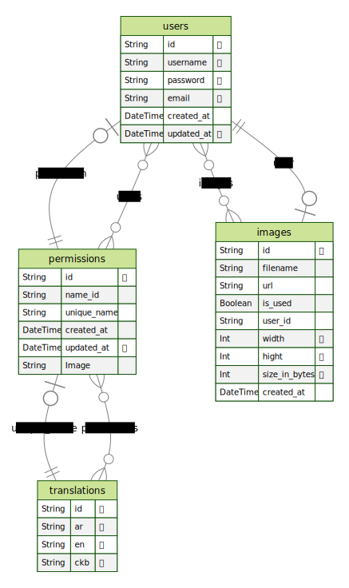

# Getting Started with Nest.js

Welcome to your journey with Nest.js! This README provides an overview of how to set up a production-grade Nest.js application using some of the best tools and libraries available.

## Prerequisites

Before you begin, ensure you have the following prerequisites installed:

- Node.js (v14 or later)
- npm or Yarn

## Installation

1. Clone this repository:

```bash
   git clone https://github.com/losefor/nest-starter
   cd nest-starter
```

2.Install dependencies:

```bash
npm install
# or
yarn install
```

## features

### ERD (Auto generated)



### Versioning

Versioning, especially in the context of software development and APIs, brings several benefits that contribute to efficient collaboration, compatibility, and overall project management

## Production-Grade Tools and Libraries

To ensure the reliability, security, and performance of our Nest.js application in production, we should use the following tools and libraries:

- [x] **express**: The foundation of Nest.js, providing a fast and minimalist web framework.
- [x] **helmet**: Enhances security by setting appropriate HTTP headers.
- [x] **morgan**: Logs incoming requests and responses for debugging and monitoring.
- [x] **class-validator**: Data validation and sanitization to prevent vulnerabilities.
- [ ] **passport.js**: Authentication middleware with support for various strategies.
- [x] **cors**: Middleware to handle Cross-Origin Resource Sharing.
- [x] **winston**: Logging libraries for structured and customizable logs.
- [x] **prisma**: A powerful Object-Relational Mapping library for database interactions.
- [ ] **Memcached**: In-memory caching solutions for improved performance.
- [ ] **nodemailer**: Sending emails, useful for features like password resets.
- [x] **pm2**: Process manager for monitoring, restarting, and load balancing.
- [x] **helmet**: Content Security Policy middleware to prevent XSS attacks.
- [x] **jest**: Testing frameworks for unit and integration tests.
- [ ] **supertest**: Library for testing HTTP requests and responses.
- [x] **eslint**: Static code analysis tool for code quality checks.
- [x] **prettier**: Code formatting tool for maintaining consistent styles.
- [x] **swagger**: Documenting your API endpoints for easy consumption.
- [ ] **sharp**: Image manipulation library used for image optimization
- [ ] **@casl/ability**: ACL authorization
- [ ] **husky**: Set up git hooks
- [ ] **multer**: Multipart handler to upload files

## Contributing

Contributions are welcome! If you find any issues or have improvements to suggest, feel free to open a pull request.

Happy coding!
